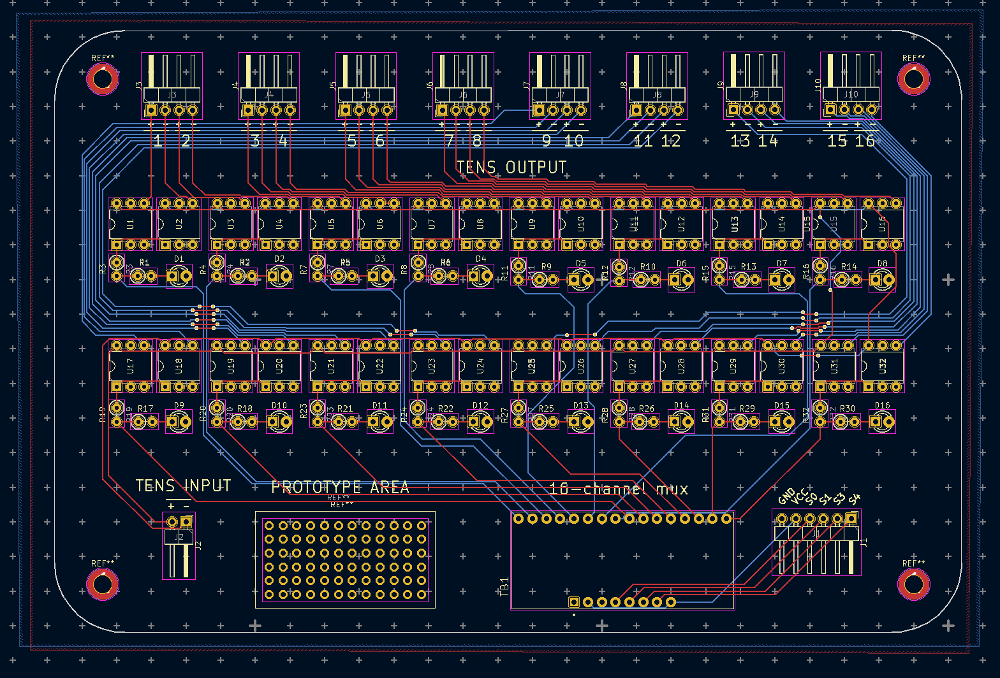
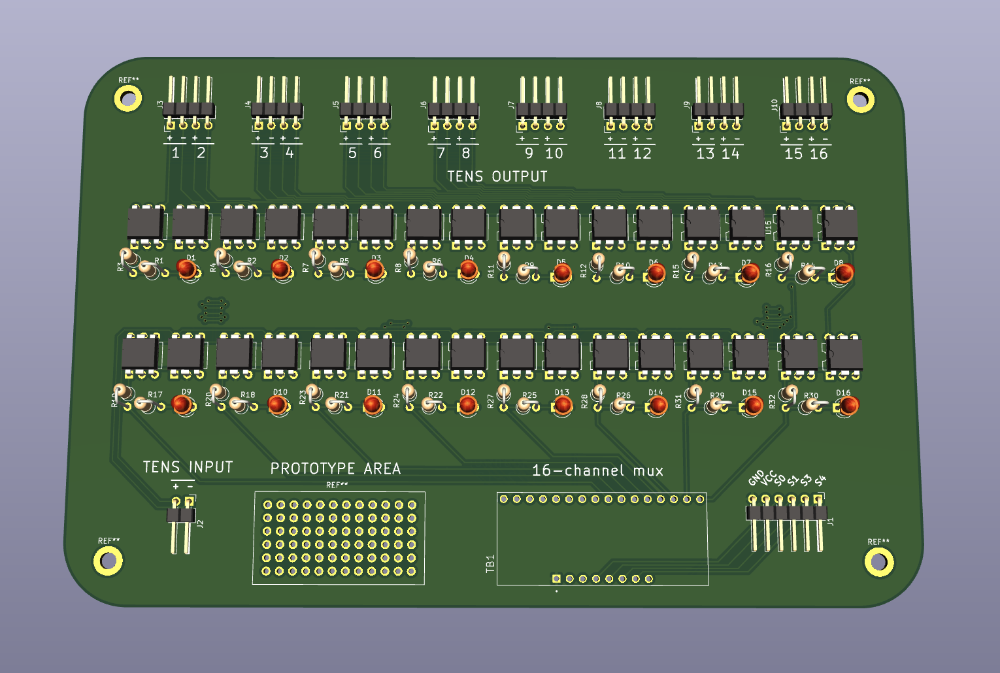

# KiCad designs

For this project we used a [Promed TENS 1000S](https://www.promed.de/soft-therapy/electrical-pain-therapy/144/promed-pain-therapy-device-tens-1000-s) TENS muscle stimulator, however there was a need to create multiple outputs, with these not needing to be active simultaneously. The TENS Output Board was designed in KiCad 6.x to support this use case. It houses a [CD74HC4067 16-channel multiplexer](https://www.sparkfun.com/products/9056) board and the switching is done using [Vishay VOR1142A6](https://www.digikey.com/en/products/detail/vishay-semiconductor-opto-division/VOR1142A6/6174564) mosfet relays.

Pressed for time the board was designed with ample room for further miniaturisation. Using solely through-hole components and spaced widely it has a distinctly oldschool look which I don't hate :)

### board layout

### 3d preview

